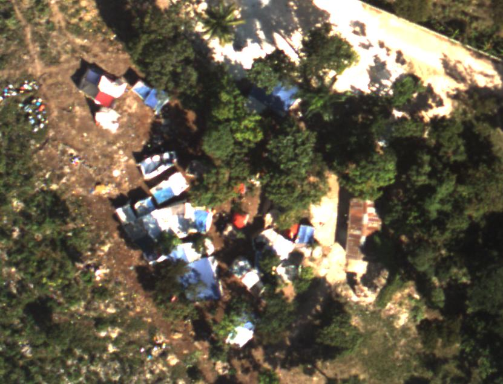

## About Me:
I hold a Master's degree in Data Science and a Bachelor's degree in Biology, and I am currently working in Neuroscience research. With my combined background in data science and biology, I strive to drive impactful research and contribute to advancements in healthcare and biotechnology. Data science is transforming the way we analyze complex biological systems, and I apply my expertise to extract meaningful insights that lead to real-world solutions. By leveraging data, I aim to make informed, evidence-based contributions that improve societal health outcomes.

## [Project 1: Real Estate - House Prices, Renovation](https://github.com/AlannaHazlett/STAT6021/tree/main/Project%202)
### Linear regression for logarithmic transformation of price with feature selection
  
  * Can the price of a house to be listed for sale be predicted? What factors influence the price of a house?
  
  * Utilizing R and tidyverse a linear regression model was created to best represent the data to make future predictions given house features.
  
  * In order to best determine a proper fitting model, exploratory data analysis was conducted, feature selection was conducted, and regression assumptions were checked to ensure they had been met.
  
  * A linear model with a low MSE of 0.0965 was achieved, creating a good predictor model for the price a house should be listed on the market for.

  

         
*Most houses have a log(price) of 13, equating to about $440,000. The training data ranges from log(price) = 11, which is about $60,000 to log(price) = 15.5, which is about $5,400,000.*     

### Logistic regression to determine if the house has been renovated
  
  * Is it possible to predict if a house has been renovated?
  
  * Utilizing R and tidyverse a logistic regression model was created to best represent the data to make future predictions given house features.
  
  * In order to best determine a proper fitting model, exploratory data analysis was conducted and feature selection was conducted.
  
  * Model performance was evaluated with ROC Curve and Confusion Matrix. The model acheived an AUC of 0.8708 showing a good performance of discriminating between non-renovated and renovated houses. 

  

*Non-renovated houses (coded as 0) show a wider interquartile range, suggesting a broad distribution of construction years. The median year built appears to be around 1975, indicating that a large proportion of non-renovated houses were built around this time.*
        
*Renovated houses (coded as 1) tend to have a slightly lower median year built, which suggests that renovations are more common in houses that were built earlier. The IQR for renovated houses is narrower, implying less variability in the construction year among renovated houses compared to non-renovated ones.*
      

  
## [Project 2: Haiti Earthquake Disaster - Image Classification of Blue Tarps](https://github.com/AlannaHazlett/DS6030/blob/main/Project/Project2_Group4.Rmd)
* In 2010 Haiti was hit by a devastating earthquake. Many homes were destroyed and people were making shelters utilizing blue tarps. In an effort to provide assistance with food and water, the Rochester Institute of Technology was flying over the country capturing images to locate people utilizing these blue tarps. Creating a model to detect the blue tarps from the pixel data of the images helps speed up the recovery efforts and provide support to survivors.

  

*An example image from the data set displaying the blue tarps used to provide shelter after the Haiti earthquake.*
* Performed exploratory data analysis.

**The most abundant category, Vegetation, averages lower pixel values than all other categories. Soil, Rooftop, and Various Non-Tarp all have higher values of Red and Green pixels, and Blue has the smallest average for all three. The blue has the highest value for the Blue Tarp category.**

* Utilized R and Tidymodels with model tuning and cross-validation for imbalanced data set to create models.

* Created a variety of models and assessed their effectiveness with the data.
  
  * Logistic Regression
  
  * Linear Discrimination Analysis
  
  * Quadratic Discrimination Analysis
  
  * K Nearest Neighbors
  
  * Random Forest
  
  * Linear Support Vector Machine
  
  * Polynomial Support Vector Machine
  
  * Radial Basis Support Vector Machine
  

*The two images above display the results of the models, with the top image showing 3 untuned models, LDA, Logistic Regression, and QDA. The bottom images shows the results of the remaining 6 models that were tuned.*

Based on the combined results from the cross-validation metrics and the holdout performance of all nine models, it was determined that Random Forest model was the best model to select for the prediction of blue tarp pixels. This conclusion arises not only from the fact that Random Forest is one of the top-performing models on the holdout data set metrics but also from its similarity in presenting solid results during the cross-validation process. The Random Forest model has a high degree of correctly predicting those places where help is needed. It has a high true positive rate/sensitivity of 0.9626, and I]it also significantly decreases the number of false positives, falsely identified blue tarps, which reduces the waste of resources. 

## Project 3: Chest Disease Classification with Explainability
* Transfer Learning of CNN models with Grad-CAM explainability feature

## Project 4: Virtual Screening for Protein Docking
* Creation of user interface for protein docking for non-technical researchers and associates
* Scalable pipeline for protein docking of nearly 1 billion ligand files
